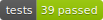
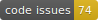

# UI Mechanics for MATLAB

[](https://github.com/ehennestad/ui-mechanics-matlab/releases/latest)
[](https://github.com/ehennestad/ui-mechanics-matlab/actions/workflows/test-code.yml)
[](https://codecov.io/gh/ehennestad/ui-mechanics-matlab)
[](https://github.com/ehennestad/ui-mechanics-matlab/security/code-scanning)
[](https://github.com/ehennestad/ui-mechanics-matlab/actions/workflows/run-codespell.yml)
[](https://gitHub.com/ehennestad/ui-mechanics-matlab/graphs/commit-activity)

Composable controls and interactions for MATLAB figures.

## Description

UI Mechanics (uim) provides reusable interface components and interaction infrastructure for programmatic MATLAB applications. It is designed for scientific viewers, image tools and other graphics-heavy apps that need controls and pointer interactions tightly integrated with plotted data. The toolbox includes composable controls, toolbars, message overlays, layout utilities, styling, and tools for zooming, panning, selection and data interaction. Its core is designed to work across traditional MATLAB figures and modern UI figures without depending on a larger application framework.

## Requirements and installation
It is recommended to use **MATLAB R2019b** or later.

Required MathWorks products:
- MATLAB

Optional:
- Image Processing Toolbox — used for hover pointer effects (skipped
  gracefully when the toolbox is absent), the crop pointer tool, dragging
  a `MessageBox` that is parented to an axes, and generating new icons
  from PNG files. Core widgets work without it.

Users or developers who clone the repository using git can use [MatBox](https://github.com/ehennestad/MatBox) to quickly install this project's [requirements](./requirements.txt) (if any):

```matlab
uimtools.installMatBox() % If MatBox is not installed
matbox.installRequirements(path/to/toolboxRootDir)
```

## Getting started

Components can be used *à la carte* — most widgets and the pointer-tool
system attach directly to a figure, panel or axes you already have, with
no framework buy-in.

### Interactive pointer tools on your own axes

Attach zoom/pan/inspect tools to any axes. Tools are toggled
programmatically, from your own toolbar buttons, or via keyboard
shortcuts if you forward key events to `onKeyPress`:

```matlab
hFigure = figure;
hAxes = axes(hFigure);
imagesc(hAxes, peaks(200))

manager = uim.interface.PointerManager(hFigure, hAxes, ...
    {'zoomIn', 'zoomOut', 'pan'});
manager.togglePointerMode('zoomIn')  % click/drag in the axes to zoom

% Optional: enable keyboard shortcuts (q/w/y = zoom in/out, pan)
hFigure.KeyPressFcn = @(src, event) manager.onKeyPress(src, event);
```

### A single widget in an existing figure

```matlab
hFigure = figure;
hAxes = axes(hFigure, 'XLim', [0, 100], 'YLim', [0, 1]);

% A frame marker (e.g. current-frame indicator for a video timeline).
% ValueChangedFcn fires when the user drags the marker.
marker = uim.widget.FrameMarker(hAxes, 'Minimum', 1, 'Maximum', 100, ...
    'ValueChangedFcn', @(src, event) disp(event.NewValue));

marker.Value = 42; % programmatic update, e.g. from your playback loop
```

### Overlay controls (toolbar, buttons, sliders)

Component-family widgets (`Toolbar`, `Button`, `RangeSlider`, ...) draw
on a transparent canvas overlaying their parent container. The canvas is
created automatically the first time a widget needs one:

```matlab
hFigure = figure;
hPanel = uipanel(hFigure);

toolbar = uim.widget.Toolbar(hPanel, 'Location', 'northeast', ...
    'BackgroundAlpha', 0.5);
toolbar.addButton('Text', 'Run', ...
    'Callback', @(src, event) disp('Run pressed'))

slider = uim.widget.RangeSlider(hPanel, 'Min', 0, 'Max', 10, ...
    'Low', 2, 'High', 8, 'Location', 'south', ...
    'Callback', @(src, event) fprintf('%.1f - %.1f\n', event.Low, event.High));
```

The same widgets can anchor *inside a data axes*: pass an axes as the
parent and an overlay canvas is created covering just that axes'
rectangle, tracking its position and size. The axes' data limits and
contents are untouched:

```matlab
hFigure = figure;
hAxes = axes(hFigure);
imagesc(hAxes, peaks(200))

toolbar = uim.widget.Toolbar(hAxes, 'Location', 'northeast', ...
    'BackgroundAlpha', 0.5);
toolbar.addButton('Text', 'Reset', ...
    'Callback', @(src, event) disp('Reset pressed'))
```

Note that the overlay anchors to the axes *Position rectangle*; under
`axis image`/`axis equal` the visible plot box can be smaller than the
rectangle, so controls anchor to the rectangle edges, not the image
edges.

## Contributing
Please see the [Contributing guidelines](.github/CONTRIBUTING.md) and the [Developer notes](.github/DeveloperNotes.md)

## License

This project is available under the MIT License. See the LICENSE file for details.

## Author

Eivind Hennestad (eivihe@uio.no)
University of Oslo
